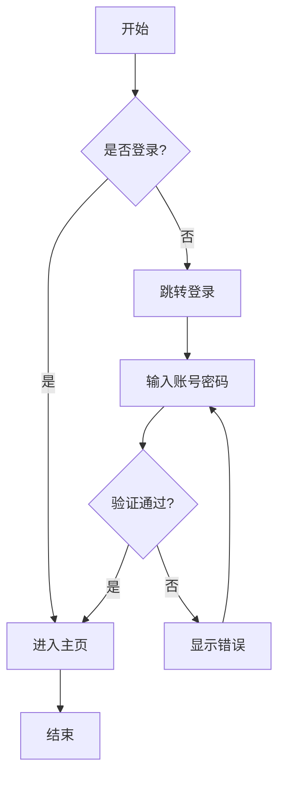
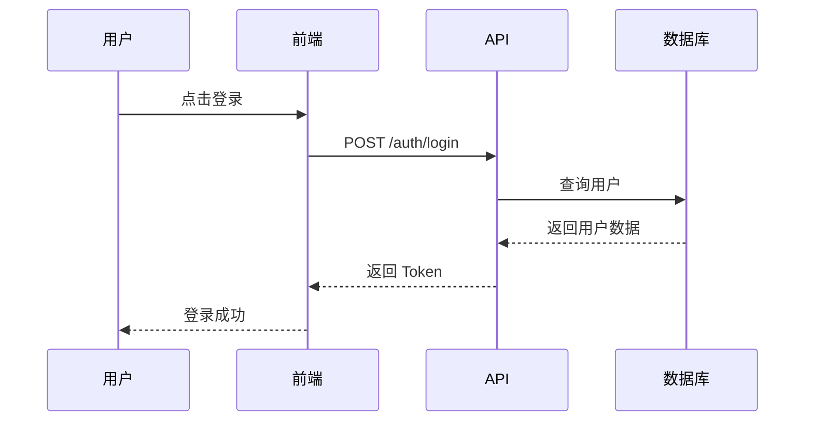
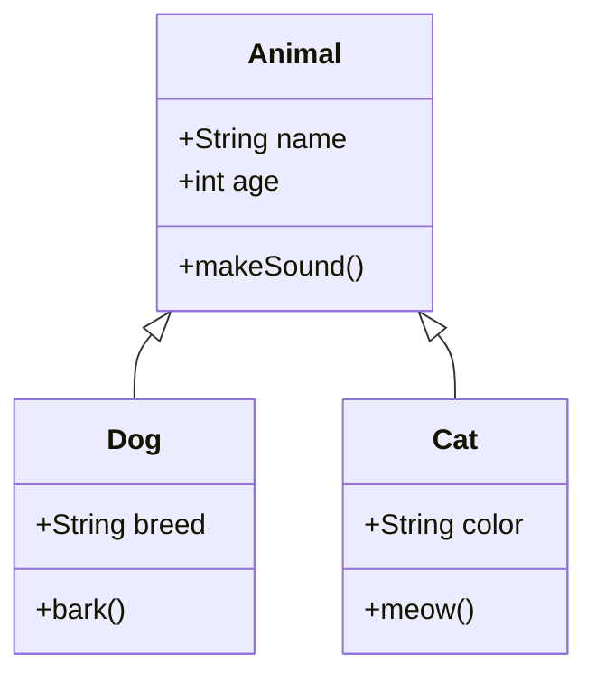

# UI 效果演示

## 📊 图表示例

### 流程图


### 时序图


### 类图


---

## 💻 代码块示例

### TypeScript
```typescript
interface User {
  id: string;
  name: string;
  email: string;
}

async function fetchUser(id: string): Promise<User> {
  const response = await fetch(`/api/users/${id}`);
  if (!response.ok) {
    throw new Error('Failed to fetch user');
  }
  return response.json();
}

// 使用示例
const user = await fetchUser('123');
console.log(`Hello, ${user.name}!`);
```

### Python
```python
from dataclasses import dataclass
from typing import List

@dataclass
class Task:
    id: int
    title: str
    completed: bool = False

class TaskManager:
    def __init__(self):
        self.tasks: List[Task] = []
    
    def add_task(self, title: str) -> Task:
        task = Task(id=len(self.tasks) + 1, title=title)
        self.tasks.append(task)
        return task
    
    def complete_task(self, task_id: int) -> bool:
        for task in self.tasks:
            if task.id == task_id:
                task.completed = True
                return True
        return False

# 使用示例
manager = TaskManager()
manager.add_task("学习 TypeScript")
manager.add_task("写单元测试")
```

### Shell
```bash
#!/bin/bash

# 部署脚本
set -e

echo "🚀 开始部署..."

# 安装依赖
npm install

# 运行测试
npm test

# 构建
npm run build

# 部署
rsync -avz dist/ user@server:/var/www/app/

echo "✅ 部署完成!"
```

### JSON 配置
```json
{
  "name": "openhorse",
  "version": "1.0.0",
  "scripts": {
    "dev": "tsx watch src/index.ts",
    "build": "tsc",
    "test": "vitest"
  },
  "dependencies": {
    "@anthropic-ai/sdk": "^0.30.0",
    "express": "^4.21.0"
  }
}
```

---

## 🎨 表格示例

| 功能 | 状态 | 描述 |
|------|------|------|
| 图表渲染 | ✅ | 支持 Mermaid 语法 |
| 代码高亮 | ✅ | 支持多种语言 |
| Markdown | ✅ | 完整语法支持 |

---

## 📝 其他格式

> 💡 **提示**: 这是一个引用块，用于显示重要信息

**粗体文本** 和 *斜体文本* 以及 `行内代码`

- 列表项 1
- 列表项 2
  - 嵌套项
- 列表项 3

1. 有序列表
2. 第二项
3. 第三项